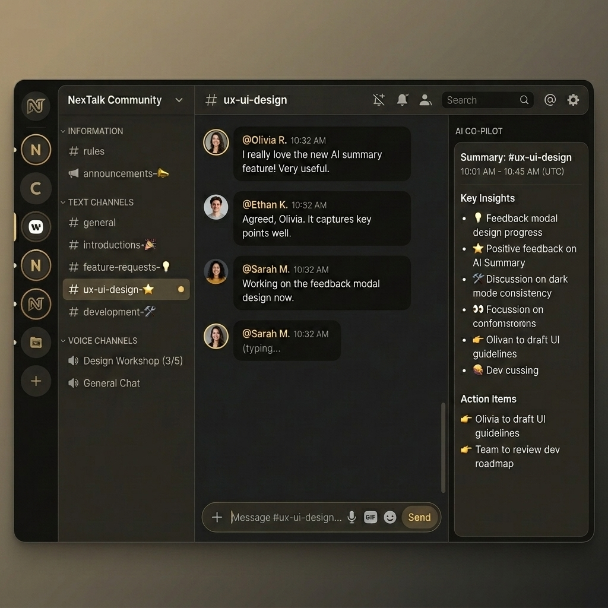

<p align="center">
  
</p>

<h1 align="center">NexTalk</h1>
<p align="center">
  <strong>Premium Real-Time Team Communication Platform</strong>
</p>
<p align="center">
  AI-powered chat summaries · HD video & voice calls · E2E encryption · Discord-style servers
</p>

---

## ✨ Features

| Feature | Description |
|---------|-------------|
| 💬 **Instant Messaging** | Sub-100ms delivery via WebSockets with reactions, file sharing, typing indicators |
| 🤖 **AI Co-Pilot** | Smart chat summaries & action items powered by Llama AI (Groq) |
| 📹 **Video & Voice Calls** | WebRTC-powered HD calls with screen share and mute controls |
| 🔐 **E2E Encryption** | AES-256-GCM encryption for DMs using browser-native Web Crypto API |
| 🏠 **Servers & Channels** | Discord-style servers with text/voice channels, roles, and invite links |
| 📁 **File Sharing** | Drag-and-drop uploads with inline previews (Cloudinary) |
| 🎨 **Dual Theme** | Taupe Black (dark) and Taupe White (light) with smooth transitions |
| 📱 **Mobile App** | React Native (Expo) companion app sharing the same backend |

## 🏗️ Tech Stack

| Layer | Technology |
|-------|------------|
| **Frontend** | Next.js 16 (App Router + Turbopack), React 19, TailwindCSS v4 |
| **Backend** | Next.js API Routes, Express + Socket.io |
| **Database** | PostgreSQL (Supabase) via Prisma ORM |
| **Auth** | Clerk (SSO, OAuth, session management) |
| **Real-time** | Socket.io with Redis adapter (Upstash) |
| **AI** | Groq SDK (Llama 3.1) for chat summarization |
| **Storage** | Cloudinary (images, files, documents) |
| **State** | Zustand + TanStack React Query |
| **Calling** | WebRTC (mesh topology) with STUN/TURN support |
| **Mobile** | Expo SDK 53 + React Native with Expo Router |

## 🚀 Quick Start

### Prerequisites
- Node.js 18+
- PostgreSQL database ([Supabase](https://supabase.com))
- [Clerk](https://clerk.com) account
- [Upstash Redis](https://upstash.com) database
- [Cloudinary](https://cloudinary.com) account

### Setup

```bash
git clone https://github.com/your-username/nextalk.git
cd nextalk
npm install
cp .env.example .env.local
# Fill in your API keys in .env.local
npx prisma db push
npm run dev
```

Open [http://localhost:3000](http://localhost:3000) to see the app.

### Mobile App

```bash
cd mobile
npm install
npx expo start
```

## 📂 Project Structure

```
nextalk/
├── app/                    # Next.js App Router pages & API routes
│   ├── (auth)/             # Sign-in / sign-up
│   ├── (main)/             # Authenticated app
│   ├── api/                # REST API endpoints
│   └── page.tsx            # Landing page
├── components/             # React components
├── hooks/                  # Custom hooks (socket, presence, voice)
├── lib/                    # Utilities (Prisma, Redis, AI, crypto)
├── server/                 # Socket.io WebSocket server
├── prisma/                 # Database schema
├── mobile/                 # React Native (Expo) mobile app
└── public/                 # Static assets
```

## 🔧 Scripts

| Command | Description |
|---------|-------------|
| `npm run dev` | Start Next.js + Socket.io |
| `npm run build` | Production build |
| `npm run db:push` | Push Prisma schema |
| `npm run db:studio` | Open Prisma Studio |

## 📜 License

MIT
