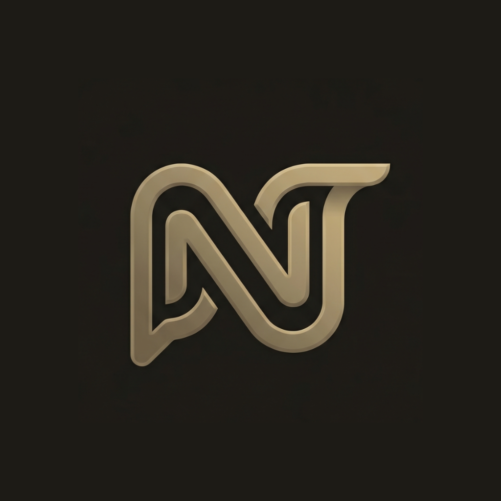
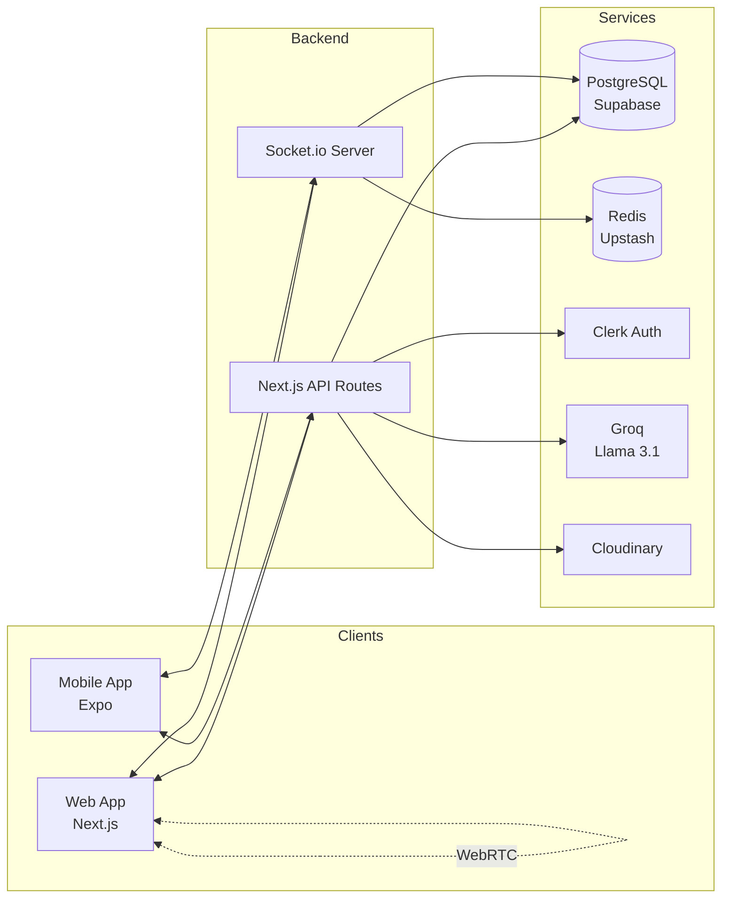

<div align="center">



# NexTalk

### Team chat that feels instant, stays private, and actually summarizes itself.

Real-time messaging, HD video calls, end-to-end encrypted DMs and community servers, with an AI co-pilot that catches you up on what you missed.

<br />


[**Live Demo**](#) · [**Features**](#-features) · [**Quick Start**](#-quick-start) · [**Architecture**](#-architecture) · [**Report a Bug**](../../issues)

<br />

<!-- Replace with a real screenshot or a short demo GIF -->


</div>

<br />

## 📖 Table of Contents

- [Why NexTalk](#-why-nextalk)
- [Features](#-features)
- [Tech Stack](#-tech-stack)
- [Architecture](#-architecture)
- [Quick Start](#-quick-start)
- [Environment Variables](#-environment-variables)
- [Mobile App](#-mobile-app)
- [Project Structure](#-project-structure)
- [Scripts](#-scripts)
- [Contributing](#-contributing)
- [License](#-license)

<br />

## 💡 Why NexTalk

Most team chat tools make you pick: fast, private, or smart. NexTalk tries to do all three.

- **Fast.** Messages travel over WebSockets, with a Redis adapter so the server can scale beyond one instance.
- **Private.** Direct messages are encrypted in your browser with AES-256-GCM before they ever leave it.
- **Smart.** Come back to 400 unread messages? One click gives you a summary and a list of action items.

<br />

## ✨ Features

<table>
<tr>
<td width="50%" valign="top">

### 💬 Instant Messaging
Sub-100ms delivery over WebSockets.
Reactions, typing indicators, and presence built in.

</td>
<td width="50%" valign="top">

### 🤖 AI Co-Pilot
Smart chat summaries and action items, powered by Llama 3.1 through Groq.

</td>
</tr>
<tr>
<td width="50%" valign="top">

### 📹 Video & Voice Calls
WebRTC HD calls with screen sharing and mute controls, with STUN/TURN support for tricky networks.

</td>
<td width="50%" valign="top">

### 🔐 End-to-End Encryption
AES-256-GCM for DMs using the browser-native Web Crypto API. No extra crypto libraries.

</td>
</tr>
<tr>
<td width="50%" valign="top">

### 🏠 Servers & Channels
Community servers with text and voice channels, roles, and shareable invite links.

</td>
<td width="50%" valign="top">

### 📁 File Sharing
Drag-and-drop uploads with inline previews, stored on Cloudinary.

</td>
</tr>
<tr>
<td width="50%" valign="top">

### 🎨 Dual Theme
**Taupe Black** (dark) and **Taupe White** (light), with smooth transitions between them.

</td>
<td width="50%" valign="top">

### 📱 Mobile App
React Native (Expo) companion app that shares the same backend as the web app.

</td>
</tr>
</table>

<br />

## 🧰 Tech Stack

| Layer | Technology |
|:------|:-----------|
| **Frontend** | Next.js 16 (App Router + Turbopack), React 19, TailwindCSS v4 |
| **Backend** | Next.js API Routes, Express + Socket.io |
| **Database** | PostgreSQL (Supabase) via Prisma ORM |
| **Auth** | Clerk (SSO, OAuth, session management) |
| **Real-time** | Socket.io with Redis adapter (Upstash) |
| **AI** | Groq SDK (Llama 3.1) for chat summarization |
| **Storage** | Cloudinary (images, files, documents) |
| **State** | Zustand + TanStack React Query |
| **Calling** | WebRTC (mesh topology) with STUN/TURN support |
| **Mobile** | Expo SDK 53 + React Native with Expo Router |

<br />

## 🏗️ Architecture


```mermaid
flowchart LR
    subgraph Clients
        W[Web App<br/>Next.js]
        M[Mobile App<br/>Expo]
    end

    subgraph Backend
        API[Next.js API Routes]
        WS[Socket.io Server]
    end

    subgraph Services
        DB[(PostgreSQL<br/>Supabase)]
        R[(Redis<br/>Upstash)]
        C[Clerk Auth]
        G[Groq<br/>Llama 3.1]
        CL[Cloudinary]
    end

    W <--> API
    M <--> API
    W <--> WS
    M <--> WS
    W <-. WebRTC .-> W

    API --> DB
    API --> G
    API --> CL
    API --> C
    WS --> R
    WS --> DB
```

**How a message flows:** the sender's client emits it over Socket.io, the server saves it through Prisma, and Redis fans it out to every connected instance, so recipients get it instantly regardless of which server they're on. DMs are encrypted client-side first, so the server only ever stores ciphertext.

<br />

## 🚀 Quick Start

### Prerequisites

- Node.js 18+
- A PostgreSQL database ([Supabase](https://supabase.com))
- A [Clerk](https://clerk.com) account
- An [Upstash Redis](https://upstash.com) database
- A [Cloudinary](https://cloudinary.com) account
- A [Groq](https://console.groq.com) API key for AI summaries

### Setup

```bash
# 1. Clone and install
git clone https://github.com/your-username/nextalk.git
cd nextalk
npm install

# 2. Configure environment
cp .env.example .env.local
# open .env.local and fill in your keys

# 3. Set up the database
npx prisma db push

# 4. Run it
npm run dev
```

Then open **[http://localhost:3000](http://localhost:3000)** and you're in.

<br />

## 🔑 Environment Variables

Copy `.env.example` to `.env.local` and fill in each service. The exact variable names live in `.env.example`; the groups are:

| Service | What you need |
|:--------|:--------------|
| **Database** | PostgreSQL connection string from Supabase |
| **Clerk** | Publishable key and secret key |
| **Redis** | Upstash REST URL and token |
| **Groq** | API key |
| **Cloudinary** | Cloud name, API key, API secret |
| **WebRTC** *(optional)* | TURN server credentials for restrictive networks |

> **Never commit `.env.local`.** It's already in `.gitignore`.

<br />

## 📱 Mobile App

The mobile app lives in `/mobile` and talks to the same backend, so accounts, servers, and messages stay in sync across devices.

```bash
cd mobile
npm install
npx expo start
```

Scan the QR code with **Expo Go** on your phone, or press `i` / `a` to open an iOS or Android simulator.

<br />

## 📂 Project Structure

```
nextalk/
├── app/                    # Next.js App Router pages & API routes
│   ├── (auth)/             # Sign-in / sign-up
│   ├── (main)/             # Authenticated app
│   ├── api/                # REST API endpoints
│   └── page.tsx            # Landing page
├── components/             # React components
├── hooks/                  # Custom hooks (socket, presence, voice)
├── lib/                    # Utilities (Prisma, Redis, AI, crypto)
├── server/                 # Socket.io WebSocket server
├── prisma/                 # Database schema
├── mobile/                 # React Native (Expo) mobile app
└── public/                 # Static assets
```

<br />

## 🔧 Scripts

| Command | What it does |
|:--------|:-------------|
| `npm run dev` | Start Next.js + Socket.io |
| `npm run build` | Production build |
| `npm run db:push` | Push the Prisma schema to the database |
| `npm run db:studio` | Open Prisma Studio |

<br />

## 🤝 Contributing

Contributions are welcome. To get started:

1. Fork the repo
2. Create a branch: `git checkout -b feature/your-idea`
3. Commit your changes: `git commit -m "Add your idea"`
4. Push the branch: `git push origin feature/your-idea`
5. Open a Pull Request

Found a bug or have a feature request? [Open an issue](../../issues).

<br />

## 📜 License

Released under the [MIT License](LICENSE).

<br />

<div align="center">

**If NexTalk helped you or you just like it, a ⭐ on the repo means a lot.**

</div>
